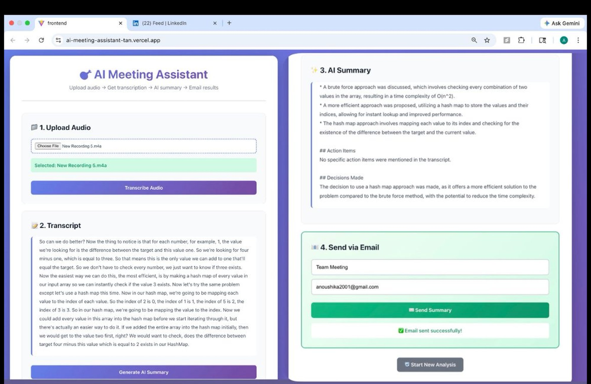

# 🎯 AI Meeting Assistant

> Transform meeting recordings into actionable insights with AI-powered transcription and intelligent summarization

[](https://ai-meeting-assistant-tan.vercel.app)
[](https://ai-meeting-assistant-ll3f.onrender.com)
[](https://ai-meeting-assistant-tan.vercel.app)
[](https://python.org)
[](https://react.dev)

**[🚀 Try Live Demo](https://ai-meeting-assistant-tan.vercel.app)** | **[📖 View Backend API](https://ai-meeting-assistant-ll3f.onrender.com)**

---

## ✨ Features

🎙️ **Audio Transcription** - Upload meeting recordings and get accurate transcripts using Groq's Whisper Large V3  
🤖 **AI-Powered Summaries** - Generate key points, action items, and decisions using Llama 3.3 70B  
📧 **Email Integration** - Send beautifully formatted summaries directly to stakeholders  
⚡ **Real-time Processing** - Fast transcription and analysis with optimized LLM inference  
🎨 **Modern UI** - Clean, responsive interface built with React and Vite  

---

## 🎬 Demo



### Try It Live!

1. Visit **[ai-meeting-assistant-tan.vercel.app](https://ai-meeting-assistant-tan.vercel.app)**
2. Upload a meeting recording (MP3, WAV, M4A, MP4, WebM)
3. Get instant transcription
4. Generate AI summary with action items
5. Email results to your team

---

## 🛠️ Tech Stack

### Backend
- **FastAPI** - High-performance Python web framework
- **Groq SDK** - Whisper Large V3 Turbo for transcription, Llama 3.3 70B for analysis
- **Resend API** - Transactional email delivery
- **Python 3.12** - Modern Python features

### Frontend
- **React 18** - Component-based UI library
- **Vite** - Lightning-fast build tool and dev server
- **CSS3** - Gradient designs and responsive layouts

### Deployment
- **Render** - Backend hosting with automatic deployments (Free tier)
- **Vercel** - Frontend hosting with edge network (Free tier)

---

## 🚀 Quick Start

### Prerequisites
```bash
Python 3.12+
Node.js 18+
Git
```

### 1. Clone Repository
```bash
git clone https://github.com/Vanoushika/ai-meeting-assistant.git
cd ai-meeting-assistant
```

### 2. Setup Backend
```bash
cd backend

# Install dependencies
pip install -r requirements.txt

# Create .env file
cat > .env << EOF
GROQ_API_KEY=your_groq_api_key_here
RESEND_API_KEY=your_resend_api_key_here
SENDER_EMAIL=onboarding@resend.dev
EOF

# Start server
uvicorn main:app --reload
```

Backend runs at: `http://localhost:8000`

### 3. Setup Frontend
```bash
cd ../frontend

# Install dependencies
npm install

# Start dev server
npm run dev
```

Frontend runs at: `http://localhost:5173`

---

## 🔑 API Keys Setup

### Groq API (Free)
1. Visit [console.groq.com](https://console.groq.com)
2. Sign up and create an API key
3. Models used: `whisper-large-v3-turbo`, `llama-3.3-70b-versatile`

### Resend API (Free)
1. Visit [resend.com](https://resend.com)
2. Sign up and create an API key
3. Use `onboarding@resend.dev` for free tier

---

## 📡 API Documentation

### Base URL
**Production**: `https://ai-meeting-assistant-ll3f.onrender.com`  
**Local**: `http://localhost:8000`

### Endpoints

#### `GET /`
Returns API information and available endpoints

**Response:**
```json
{
  "message": "AI Meeting Assistant API",
  "version": "2.0",
  "endpoints": {
    "/transcribe": "POST - Upload audio for transcription",
    "/analyze": "POST - Analyze transcript",
    "/send-email": "POST - Send summary via email"
  }
}
```

#### `POST /transcribe`
Upload audio file for transcription

**Request:**
- Content-Type: `multipart/form-data`
- Body: `file` (audio file)

**Response:**
```json
{
  "success": true,
  "transcript": "Meeting transcript text...",
  "language": "en"
}
```

#### `POST /analyze`
Generate AI summary from transcript

**Request:**
- Content-Type: `application/x-www-form-urlencoded`
- Body: `transcript` (string)

**Response:**
```json
{
  "success": true,
  "summary": "AI-generated summary with key points...",
  "model": "llama-3.3-70b-versatile"
}
```

#### `POST /send-email`
Send summary via email

**Request:**
- Content-Type: `application/json`
- Body:
```json
{
  "email": "recipient@example.com",
  "summary": "AI summary text",
  "transcript": "Full transcript",
  "meeting_title": "Team Standup"
}
```

**Response:**
```json
{
  "success": true,
  "message": "Summary sent to recipient@example.com",
  "email_id": "..."
}
```

---

## 📊 Project Structure
```
ai-meeting-assistant/
├── backend/
│   ├── main.py              # FastAPI application
│   ├── requirements.txt     # Python dependencies
│   └── .env                 # Environment variables (gitignored)
├── frontend/
│   ├── src/
│   │   ├── App.jsx          # Main React component
│   │   ├── App.css          # Styles
│   │   └── main.jsx         # Entry point
│   ├── package.json         # Node dependencies
│   └── index.html           # HTML template
└── README.md
```

---

## 🌍 Deployment

### Backend (Render)

1. **Connect GitHub**: Link your repository to Render
2. **Configure**:
   - Root Directory: `backend`
   - Build Command: `pip install -r requirements.txt`
   - Start Command: `uvicorn main:app --host 0.0.0.0 --port $PORT`
3. **Environment Variables**: Add `GROQ_API_KEY`, `RESEND_API_KEY`, `SENDER_EMAIL`
4. **Deploy**: Render auto-deploys on git push

### Frontend (Vercel)

1. **Connect GitHub**: Import repository to Vercel
2. **Configure**:
   - Root Directory: `frontend`
   - Framework: Vite
   - Build Command: `npm run build`
   - Output Directory: `dist`
3. **Deploy**: Vercel auto-deploys on git push

---

## 🎯 Use Cases

- **Corporate Meetings**: Automatically document decisions and action items
- **Client Calls**: Share professional summaries with clients
- **Interviews**: Generate transcripts and key takeaways
- **Lectures**: Create study notes from recorded lectures
- **Podcasts**: Generate show notes and transcripts

---

## 🔒 Security & Privacy

- ✅ Audio files processed temporarily and deleted immediately
- ✅ No data stored on servers after processing
- ✅ Secure HTTPS connections for all API calls
- ✅ Environment variables for sensitive credentials
- ✅ CORS configured for authorized domains only

---

## 🚧 Roadmap

- [ ] Multi-language support (50+ languages)
- [ ] Real-time transcription via WebSocket
- [ ] Speaker diarization (identify different speakers)
- [ ] Calendar integration (Google Calendar, Outlook)
- [ ] Team collaboration features
- [ ] Custom AI models for domain-specific terminology
- [ ] Mobile app (React Native)
- [ ] Browser extension for meeting platforms

---

## 🤝 Contributing

Contributions are welcome! Please feel free to submit a Pull Request.

1. Fork the repository
2. Create your feature branch (`git checkout -b feature/AmazingFeature`)
3. Commit your changes (`git commit -m 'Add some AmazingFeature'`)
4. Push to the branch (`git push origin feature/AmazingFeature`)
5. Open a Pull Request

---

## 📄 License

This project is licensed under the MIT License - feel free to use it for your portfolio!

---

## 👩‍💻 Author

**Anoushika**

- GitHub: [@Vanoushika](https://github.com/Vanoushika)
- LinkedIn: [https://www.linkedin.com/in/anoushika/)

---

## 🙏 Acknowledgments

- **Groq** - For providing fast LLM inference API
- **Resend** - For reliable email delivery service
- **Render & Vercel** - For free hosting tiers
- **FastAPI** - For excellent Python web framework
- **React & Vite** - For modern frontend development

---

## 📬 Contact

Have questions or suggestions? Open an issue or reach out!

**Built with ❤️ using Groq, FastAPI, and React**

---

### ⭐ Star this repo if you find it useful!
